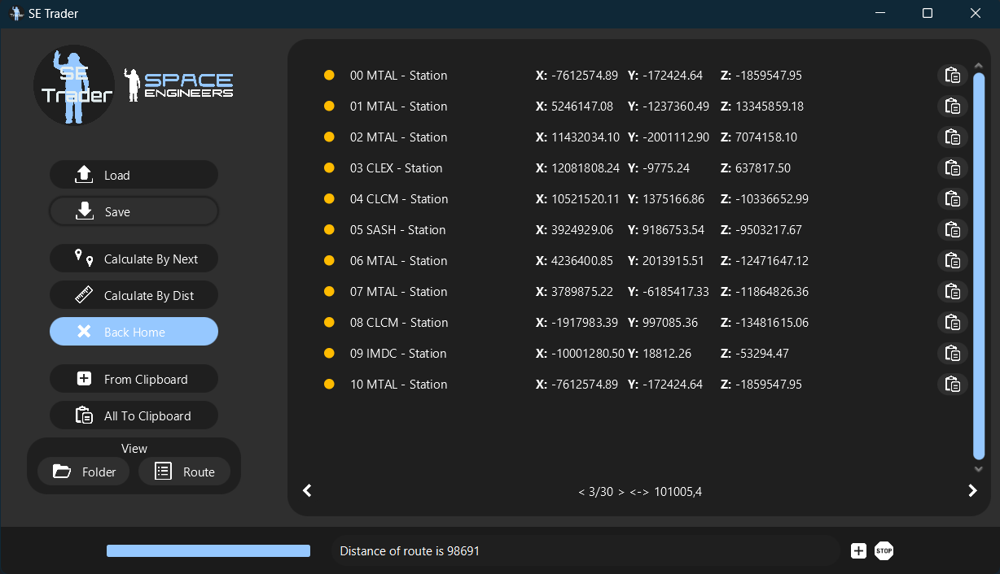

<p align="center">
  
</p>

<h3 align="center">SE Trader</h3>

<p align="center">
  Made for Space Engineers for easier travels
  <br>
  <a href="https://github.com/sobotat/SE_Trader/discussions/categories/ideas">Request feature</a>  
  ·
  <a href="https://github.com/sobotat/SE_Trader/issues">Report bug</a>
  ·
  <a href="https://github.com/sobotat/SE_Trader/discussions/categories/q-a">Questions</a>
  · 
  <a href="https://github.com/sobotat">Author</a>
</p>

---
### <span style="color:#96c8ff">Info</span>

An app that makes it easy for you to choose a trading route. 


* SE Trader have two modes how to help you
  - **Better**: Will calculate every route and find for you the best one.
  - **Fast**:   Will calculate the shortest jump from every GPS, like player in game.

* Modern UI
* Using Clipboard and format like in the game

---
### <span style="color:#96c8ff">UI</span>


---
### <span style="color:#96c8ff">How To Use</span>

1. Add your GPS, Save it if you want
2. Calculate:
   - **By Next** - Finds the shortest distance from the GPS
   - **By Dist** - It will find all combinations. Calculates the distance and finds the smallest.
3. Now you are done with bad routes

PS: _You can find your **Route** in `Documents\SE_Trader\route.txt` or click **View Route**_

---
### <span style="color:#96c8ff">Install</span>
    📢 It will warn you that the software is unsafe. This is because it has no certificate.
       (Too expensive for a student's life)

1. Download **exe** or **msi** file <a href="https://github.com/sobotat/SE_Trader/releases/latest">📄 From Here</a>
2. Install it and you are ready to use.

PS: *GPS and Route File is located in `Documents\SE_Trader` folder*

---
### <span style="color:#96c8ff">Work to need to be done</span>

   - Add Settings Page
   - ~~Implement Log System~~
   - Make App Better

---
### <span style="color:#96c8ff">GPS Format</span>

The GPS format is taken from the game.
So there is no need to redo anything. <br>
In case you want to use the app for other things. <br> 
The GPS consists of a name, x, y, z coordinates and a color in hex.

```text
---:NAME---:X------:Y------:Z------:COLOR--:
GPS:Station:25000.5:25000.5:25000.5:#96c8ff:
```
---
### <span style="color:#96c8ff">Ideas or Bugs</span>

It's like with any software. I'll be glad for any reported bugs, and I'll also be glad for ideas on how to improve the application.

🛠️ You can report a bug <a href="https://github.com/sobotat/SE_Trader/issues">Here</a> <br>
⭐ Here you can tell about your idea <a href="https://github.com/sobotat/SE_Trader/discussions/categories/ideas">Here</a>

---
### <span style="color:#96c8ff">Changelog</span>

<details>    
<summary>Show</summary>

    - v0.0
      - Working load and save of GPS
      - Distance to other GPS
      - Closest GPS
      - Load GPS on startup
    - v1.0
      - Working finding shortest Route
         - By Distance
         - By Jump
      - Added option to go back to home
    - v1.1
      - Design OverHaul
      - Fixed threats run after cloasing application
      - Added new Icon
      - Added GPS autosave after cloasing application
    - v1.1.1
      - Improve Buttons design
      - Added Reworked Table
    - v1.1.2
      - Improve Texts of X,Y,Z Table
      - Added Remove Btn to table
      - Added Clipboard to Enter And Copy Button
      - Improve output from Calculate Entire route now outputing every 2 sec
      - Fixed Icon on header
      - Locked Resizing aplication
    - v1.1.3
      - Removed remove button
      - Fixed remove button on the items
      - Added Copy all to the clipboard
      - Improve position of buttons
      - Fixed bug with not able to clean list
      - Added automatic show of route after calculating route
      - Added enter button next to textfield
      - Changed backHome checkbox
      - Changed Enter button to From Clipboard
    - v1.1.4
      - Massive optimization in calculating      
      - Increase RAM to 4GB
      - Added Stop button
      - Fixed bug with not responding on calculate by dist
      - Fixed Calculate by Dist was returning wrong route
      - Improve design of wrong input from files
      - Change output timer to 0,5sec
      - Fixed bug not reseting min distance
    - v1.2
      - Implemented Logging System
      - Added Settings File
      - Added Home Button, implemented into route calculation and fixed
      - Added options to browse routes
      - Added button to open application folder
      - Redesigned the app to change the size of the window.
      - Implemented saving window size on save.
      - Enabled the ability to resize the window.
      - Fixed app icon in title bar
      - Button design reworked
      - Calculation Optimalization


</details>

---

#### <span style="color:#96c8ff">Thanks</span>

🎖️ For his **help** and **ideas** [<a href="https://steamcommunity.com/profiles/76561198029329464">N.Blue</a>] <br>
🏅 For finding a big bug in route calculation [<a href="https://github.com/jakubhyza">Jakub Hýža</a>]