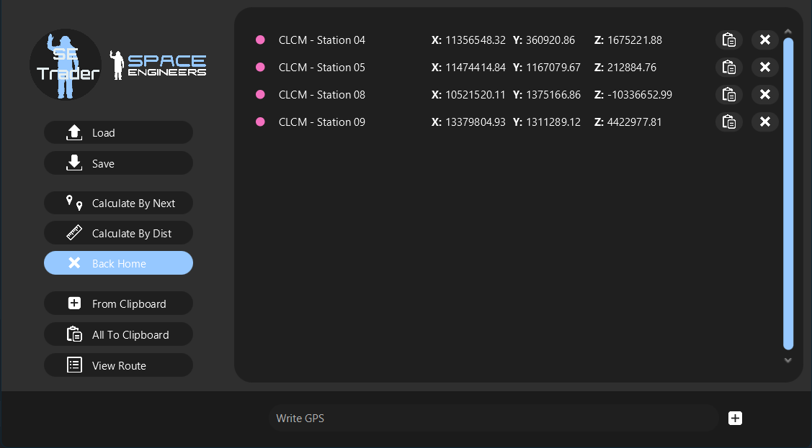

# SE Traider

Made for Space Engineers for easier travels

An app that makes it easy for you to choose a trading route. Filter different types of stations.

---

### ScreenShots

---
### How to use

1. Add your GPS, Save it if you want
2. Calculate:
   - **By Next** - Finds the shortest distance from the GPS
   - **By Dist** - It will find all combinations. Calculates the distance and finds the smallest.
3. You can find your Route in **Documents\SE_Trader\route.txt** or click **View Route**

---

## Install
1. Download **exe** or **msi** file
2. Install it and you are ready to use.
3. GPS and Route File is located in **Documents\SE_Trader** folder

---

### Changelog:

    

Show

    - v0.0
      - Working load and save of GPS
      - Distance to other GPS
      - Closest GPS
      - Load GPS on startup
    - v1.0
      - Working finding shortest Route
         - By Distance
         - By Jump
      - Added option to go back to home
    - v1.1
      - Design OverHaul
      - Fixed threats run after cloasing application
      - Added new Icon
      - Added GPS autosave after cloasing application
    - v1.1.1
      - Improve Buttons design
      - Added Reworked Table
    - v1.1.2
      - Improve Texts of X,Y,Z Table
      - Added Remove Btn to table
      - Added Clipboard to Enter And Copy Button
      - Improve output from Calculate Entire route now outputing every 2 sec
      - Fixed Icon on header
      - Locked Resizing aplication
    - v1.1.3
      - Removed remove button
      - Fixed remove button on the items
      - Added Copy all to the clipboard
      - Improve position of buttons
      - Fixed bug with not able to clean list
      - Added automatic show of route after calculating route
      - Added enter button next to textfield
      - Changed backHome checkbox
      - Changed Enter button to From Clipboard

